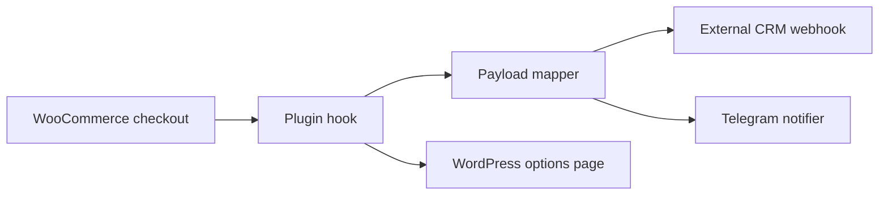

# Архитектура: Checkout Bridge for WooCommerce

```mermaid
flowchart LR
    A["WooCommerce checkout"] --> B["Plugin hook"]
    B --> C["Payload mapper"]
    C --> D["External CRM webhook"]
    C --> E["Telegram notifier"]
    B --> F["WordPress options page"]
```

## Ключевой принцип

Плагин не переписывает checkout, а встраивается в событие заказа и аккуратно обрабатывает интеграционный слой отдельно.

