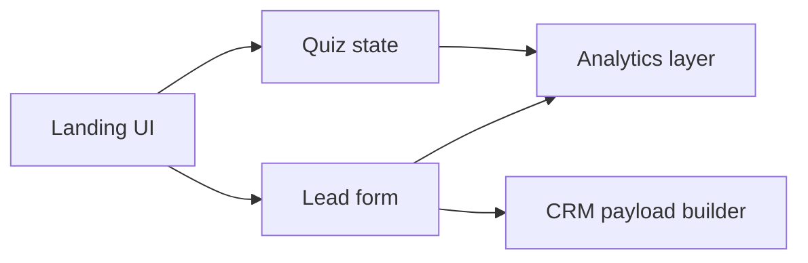

# Архитектура: Conversion Landing Kit

## Ключевой принцип

Frontend здесь не декоративный, а процессный: посетитель квалифицируется, отправляет заявку, а система готовит события и структуру лида.

