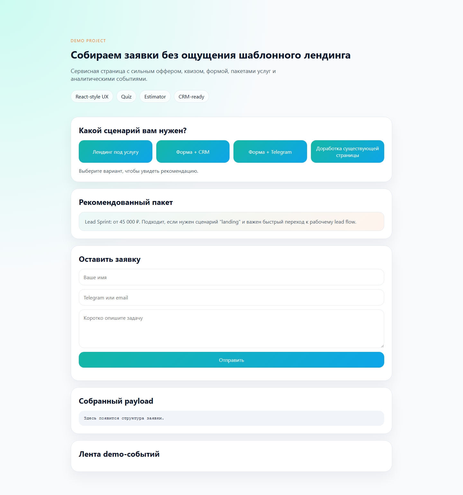
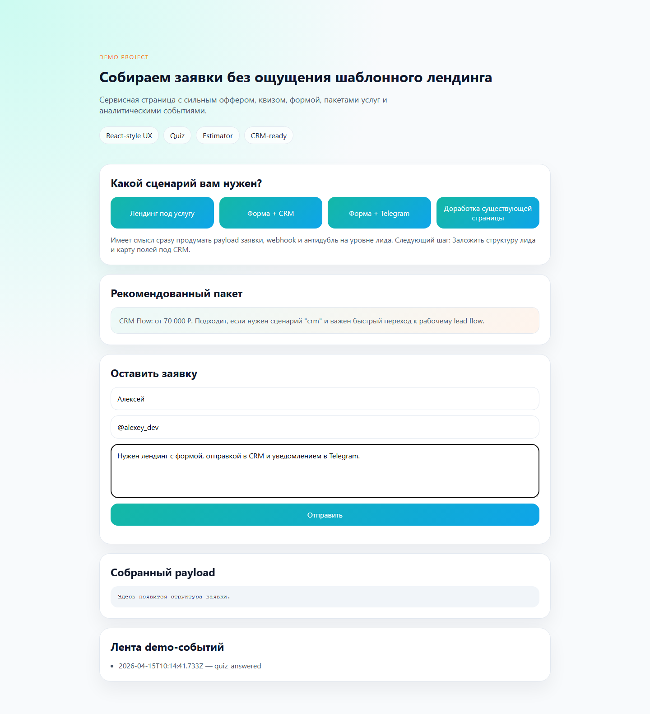

# Конструктор конверсионного лендинга

Демонстрационный frontend-набор для сервисной посадочной страницы с квизом, формой заявки, событиями аналитики и CRM-отправкой.

## Скриншоты

## Что показывает проект

- сильный и понятный frontend для услуги;
- сбор лидов через форму и квиз;
- базовую аналитическую событийность;
- отправку заявки во внешний контур;
- адаптивную структуру сервисного посадочной страницы;
- черновик в localStorage, предпросмотр payload и ленту демо-событий.
- package estimator под разные типы задач;
- сценарную квалификацию до отправки в CRM.

## Для каких задач подходит

- лендинги и промо-сайты;
- frontend под бизнес-задачу;
- формы и квизы;
- лидогенерацию;
- React/Next-подход в малом объёме.

## Состав пакета

- [CASE.md](C:/Users/KIFER/Desktop/ТГ%20фриланс%20бот/portfolio_lab/projects/conversion-landing-kit/CASE.md)
- [ARCHITECTURE.md](C:/Users/KIFER/Desktop/ТГ%20фриланс%20бот/portfolio_lab/projects/conversion-landing-kit/ARCHITECTURE.md)
- `site/index.html` — демо-страница;
- `site/styles.css` — визуальный слой;
- `site/app.js` — квиз, аналитические события и форма;
- `seed/content.json` — демо-контент;
- `tests/test_content_contract.py` — минимальная проверка данных.

<!-- COMMERCIAL_CONTEXT:START -->
## Живой коммерческий контекст

- Типовой заказчик: сервисный бизнес, которому нужен не просто сайт, а посадочная страница с квалификацией лида
- Кто принимает решение: маркетолог, владелец бизнеса или проджект агентства
- Типовой запрос: Нужен лендинг с квизом, аналитикой, CRM-отправкой и понятной логикой сбора заявки.
- Формат подачи: это публичный showcase на основе реального рыночного сценария, а не выдуманная история про клиента.
- [Полный коммерческий разбор](./COMMERCIAL_CONTEXT.md)
<!-- COMMERCIAL_CONTEXT:END -->
