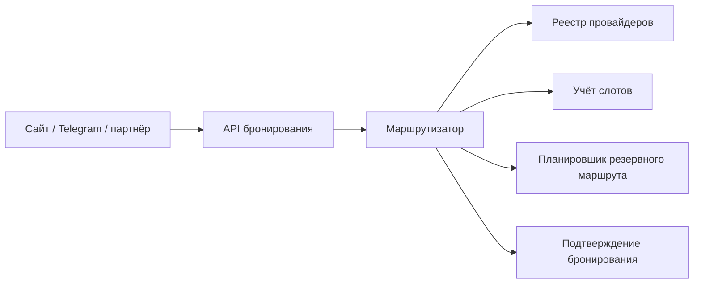

# Архитектура: EventMesh Booking Router

```mermaid
flowchart LR
    A["Сайт / Telegram / партнёр"] --> B["API бронирования"]
    B --> C["Маршрутизатор"]
    C --> D["Реестр провайдеров"]
    C --> E["Учёт слотов"]
    C --> F["Планировщик резервного маршрута"]
    C --> G["Подтверждение бронирования"]
```

## Ключевой принцип

Система сначала проверяет совместимость запросом с провайдерами и слотами, а только потом фиксирует маршрут или резервный маршрут.

