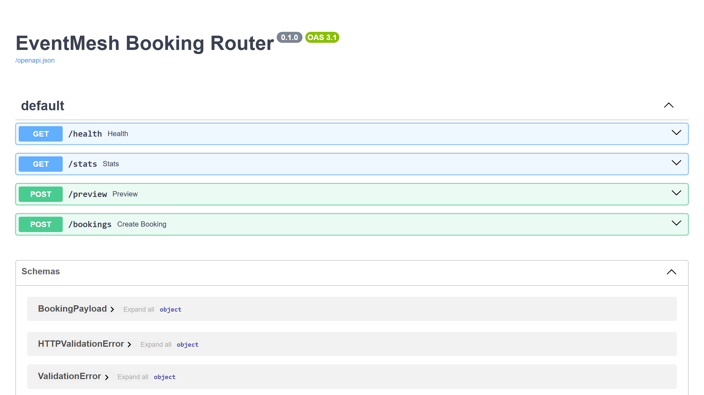

# Маршрутизатор бронирований EventMesh

## Витрина

Скриншоты и GIF складываются в `assets/`.

- shot-list: `SHOTLIST.md`
- assets: `assets/README.md`



`Маршрутизатор бронирований EventMesh` показывает, как собрать сервис, который принимает заявки из разных каналов и распределяет их между провайдерами, слотами и резервными маршрутами без конфликтов и ручной координации.

## Что показывает проект

- маршрутизацию бронирований между несколькими провайдерами;
- проверку доступных слотов и защиту от конфликтов;
- fallback-логику для перегруженных и недоступных сценариев;
- единый вход из сайта, Telegram и партнёрских каналов;
- работу со срочными, VIP и внерабочими заявками;
- архитектуру для booking, scheduling и service-dispatch задач.

## Для каких задач подходит

- системы бронирования и планирования;
- API-интеграции с внешними провайдерами слотов;
- сервисы с несколькими командами или подрядчиками;
- единый контур заявок из нескольких каналов входа;
- нестандартные процессы, где важна автоматическая маршрутизация.

## Ключевые сценарии

- распределение новой заявки по подходящему провайдеру;
- выбор резервного маршрута при недоступности слота;
- обработка срочного или VIP-бронирования;
- маршрутизация вне стандартного рабочего окна;
- синхронизация внешнего канала с внутренним контуром бронирования.

## Состав пакета

- [CASE.md](C:/Users/KIFER/Desktop/ТГ%20фриланс%20бот/portfolio_lab/projects/eventmesh-booking-router/CASE.md)
- [ARCHITECTURE.md](C:/Users/KIFER/Desktop/ТГ%20фриланс%20бот/portfolio_lab/projects/eventmesh-booking-router/ARCHITECTURE.md)
- `app/core.py` — доменная логика маршрутизации, слотов и fallback;
- `app/main.py` — FastAPI-слой;
- `seed/demo_seed.json` — демо-провайдеры и бронирования;
- `tests/test_core.py` — минимальные тесты.

## Стек

- Python
- FastAPI
- маршрутизация по правилам
- JSON seed-данные

## Быстрый старт

```bash
pip install -r requirements.txt
uvicorn app.main:app --reload
```

## Почему это сильный кейс

- хорошо показывает нестандартную прикладную логику, а не только CRUD;
- помогает заходить в заказы про booking, multi-provider routing, scheduling и сложные API-связки;
- выгодно выделяет профиль на фоне типовых “сделаю бота/сайт” за счёт более редкого operational-сценария.

<!-- COMMERCIAL_CONTEXT:START -->
## Живой коммерческий контекст

- Типовой заказчик: сервис бронирования с несколькими подрядчиками, слотами или региональными командами.
- Кто принимает решение: product owner, операционный руководитель или интеграционный архитектор.
- Типовой запрос: нужна маршрутизация бронирований между несколькими провайдерами с учётом слотов, приоритетов и fallback-логики.
- Формат подачи: это публичный showcase на основе реального рыночного сценария, а не выдуманная история про клиента.
- [Полный коммерческий разбор](./COMMERCIAL_CONTEXT.md)
<!-- COMMERCIAL_CONTEXT:END -->
