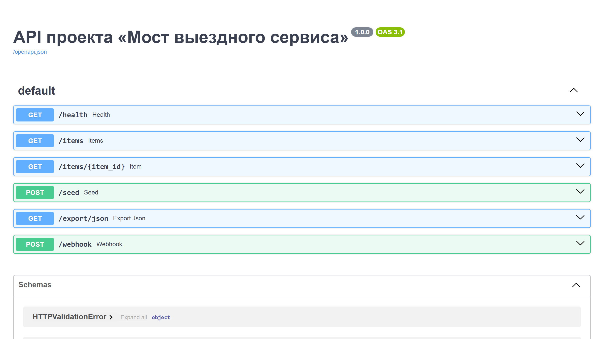

# РњРѕСЃС‚ выездного сервиса

## Витрина

Скриншоты и GIF складываются в `assets/`.

- shot-list: `SHOTLIST.md`
- assets: `assets/README.md`

`Мост выездного сервиса` — большой витринный Telegram-бот.



## Фокус

- Нужно управлять выездными инженерами в Telegram, распределять визиты, отслеживать запчасти и держать менеджера в курсе сбоев.
- Показывает зрелость в сервисных процессах, SLA, маршрутах визитов и пост-визитной отчётности.
- Направление: `выездной сервис, планирование инженеров, запчасти, SLA`

## Крупные блоки функционала

- распределение инженеров
- резерв запчастей
- SLA
- отчет после визита
- эскалации

## Ключевые сценарии

- Новая заявка
- Срочный ремонт
- Запчасти не в наличии
- Повторный визит
- VIP клиент

## Роли

- клиент
- координатор
- инженер
- владелец

## Категории

- установка
- ремонт
- осмотр
- VIP
- запчасти

## Структура

- `bot/domain.py`
- `bot/storage.py`
- `bot/workflow.py`
- `bot/analytics.py`
- `bot/reporting.py`
- `bot/policies.py`
- `bot/contracts.py`
- `bot/exports.py`
- `bot/simulation.py`
- `bot/admin.py`
- `bot/messages.py`
- `bot/seeds.py`
- `bot/service.py`
- `bot/repository_sqlite.py`
- `bot/webhooks.py`
- `bot/api.py`
- `bot/cli.py`
- `bot/dashboard_schema.py`
- `bot/fixtures.py`
- `bot/audits.py`
- `bot/benchmarks.py`
- `bot/main.py`
- `tests/test_logic.py`

## Быстрый старт

```bash
pip install -r requirements.txt
python -m bot.main
uvicorn bot.api:create_app --factory --reload
```

## Почему это сильный кейс

- показывает не просто “бота”, а взрослый прикладной рабочий сценарий;
- раскрывает направление: `полевые операции, маршрут инженера, резерв запчастей, отчеты по визитам`;
- хорошо продаёт нетипичные запросы заказчиков.

<!-- COMMERCIAL_CONTEXT:START -->
## Живой коммерческий контекст

- Типовой заказчик: сервисная компания с инженерами, мастерами или выездными специалистами
- Кто принимает решение: сервисный директор или операционный менеджер
- Типовой запрос: Нужен бот для распределения выездов, контроля SLA, запчастей и повторных визитов.
- Формат подачи: это публичный showcase на основе реального рыночного сценария, а не выдуманная история про клиента.
- [Полный коммерческий разбор](./COMMERCIAL_CONTEXT.md)
<!-- COMMERCIAL_CONTEXT:END -->
