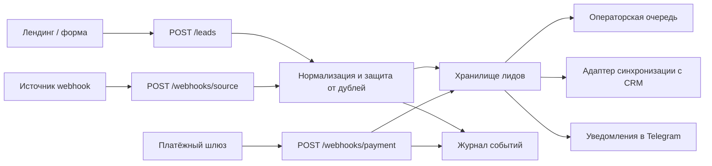

# Архитектура: FlowDesk CRM Hub

## Узлы

- `Хранилище лидов` — единая запись по лидам.
- `Журнал событий` — история действий и интеграционных событий.
- `Адаптер синхронизации с CRM` — точка отправки во внешнюю систему.
- `Уведомления в Telegram` — канал оперативного уведомления.
- `Операторская очередь` — рабочий список для менеджера.

## Главное решение

Сначала нормализация и защита от дублей, потом уже внешние действия. Это даёт устойчивый и объяснимый контур.

