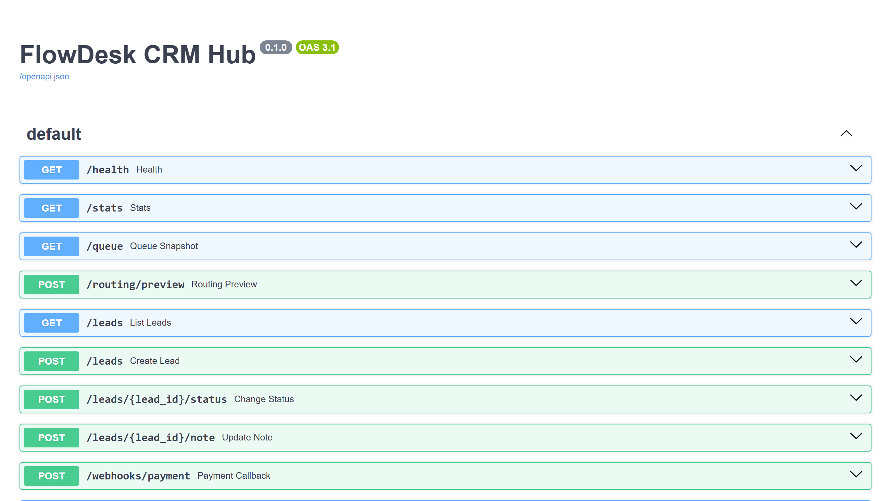

# FlowDesk CRM Hub

## Витрина

Скриншоты и GIF складываются в `assets/`.

- shot-list: `SHOTLIST.md`
- assets: `assets/README.md`



`FlowDesk CRM Hub` показывает прикладной контур приёма заявок для сервисного бизнеса: формы, webhook, CRM-логика, Telegram-уведомления, журнал событий и платёжный callback в одном рабочем маршруте.

## Что показывает проект

- единый приём лидов из лендингов, рекламы, Telegram и внешних каналов;
- нормализацию входящих данных и антидубль по сигнатуре заявки;
- приоритизацию очереди и lead scoring;
- webhook-интеграции и операторскую обработку;
- жизненный цикл заявки от первого касания до статуса оплаты;
- архитектуру, пригодную для сервисных сайтов, внутренних CRM-контуров и прикладных веб-продуктов.

## Для каких задач подходит

- CRM/API интеграции;
- формы заявок и post-submit логика;
- операторская панель и рабочая очередь;
- Telegram и email уведомления;
- payment callback и статусные сценарии;
- backend для сервисных лендингов, маркетинговых воронок и внутренних кабинетов.

## Ключевые сценарии

- отправка лида из формы или landing page;
- нормализация и отсечение дублей;
- создание записи в очереди оператора;
- webhook или уведомление во внешнюю систему;
- обновление статуса и добавление заметки;
- фиксация платёжного callback и истории событий.

## Состав пакета

- [CASE.md](C:/Users/KIFER/Desktop/ТГ%20фриланс%20бот/portfolio_lab/projects/flowdesk-crm-hub/CASE.md)
- [ARCHITECTURE.md](C:/Users/KIFER/Desktop/ТГ%20фриланс%20бот/portfolio_lab/projects/flowdesk-crm-hub/ARCHITECTURE.md)
- `app/core.py` — доменная логика лидов, скоринга, тегов и маршрутизации;
- `app/main.py` — FastAPI-слой со статистикой, очередью и платёжным callback;
- `seed/demo_seed.json` — подготовленные демо-данные;
- `tests/test_core.py` — минимальные автотесты.

## Стек

- Python
- FastAPI
- Pydantic
- JSON seed-данные

## Быстрый старт

```bash
pip install -r requirements.txt
uvicorn app.main:app --reload
```

## Почему это сильный кейс

- хорошо продаёт направление `CRM/API + integrations + operator workflow`;
- показывает, что проект умеет жить не только в UI, но и в статусной, событийной логике;
- помогает заходить в заказы, где нужен реальный рабочий контур обработки лидов, а не просто форма на сайте.

<!-- COMMERCIAL_CONTEXT:START -->
## Живой коммерческий контекст

- Типовой заказчик: сервисная компания с лидами из лендингов, рекламы и Telegram.
- Кто принимает решение: руководитель продаж, операционный менеджер или владелец бизнеса.
- Типовой запрос: нужен единый контур приёма заявок с формами, webhook, CRM-логикой, Telegram и статусами оплаты.
- Формат подачи: это публичный showcase на основе реального рыночного сценария, а не выдуманная история про клиента.
- [Полный коммерческий разбор](./COMMERCIAL_CONTEXT.md)
<!-- COMMERCIAL_CONTEXT:END -->
