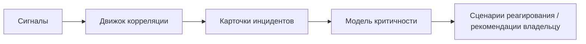

# Архитектура: Incident Command Center

```mermaid
flowchart LR
    A["Сигналы"] --> B["Движок корреляции"]
    B --> C["Карточки инцидентов"]
    C --> D["Модель критичности"]
    D --> E["Сценарии реагирования / рекомендации владельцу"]
```

