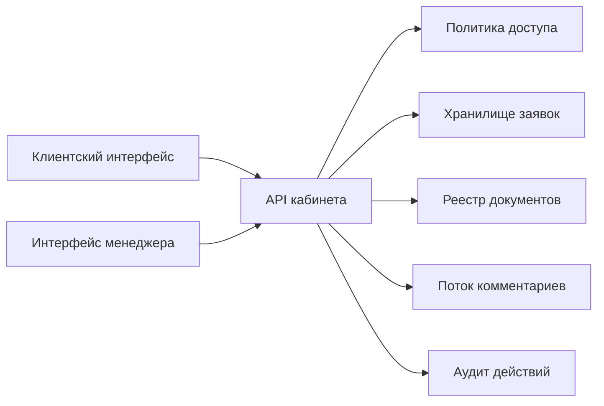

# Архитектура: OpsPortal B2B Cabinet

## Ключевая идея

Каждое действие в кабинете сначала проходит через политику доступа и только потом меняет данные. Это удобно показывать заказчику как доказательство зрелой архитектуры.

