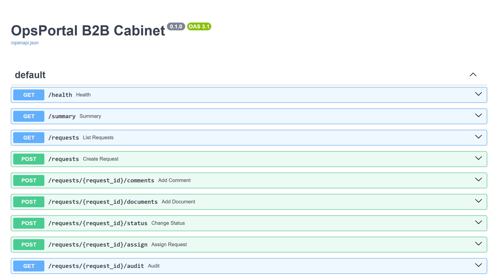

# OpsPortal B2B Cabinet

## Витрина

Скриншоты и GIF складываются в `assets/`.

- shot-list: `SHOTLIST.md`
- assets: `assets/README.md`



`OpsPortal B2B Cabinet` показывает зрелый B2B-кабинет и внутреннюю операторскую панель: роли, заявки, документы, комментарии, безопасные переходы статусов и аудит действий в одном рабочем процессе.

## Что показывает проект

- ролевую модель доступа и ограничения по бизнес-правилам;
- работу со статусами, документами и внутренней коммуникацией;
- назначение ответственного и контроль процесса по карточке;
- audit trail и прозрачную историю действий;
- сценарии согласования для security, finance и владельца;
- архитектуру, подходящую для B2B-сервисов, личных кабинетов и административных контуров.

## Для каких задач подходит

- личные кабинеты и B2B-платформы;
- административные панели и внутренние инструменты;
- workflow с ролями, маршрутами и историей действий;
- документооборот и безопасные статусные переходы;
- операторские сценарии для менеджеров и backoffice-команд.

## Ключевые сценарии

- регистрация и ведение карточки клиента;
- работа с документами и проверка обязательных вложений;
- перевод заявки между этапами согласования;
- назначение менеджера и эскалация при задержке;
- просмотр аудита и причин изменений по карточке.

## Состав пакета

- [CASE.md](C:/Users/KIFER/Desktop/ТГ%20фриланс%20бот/portfolio_lab/projects/opsportal-b2b-cabinet/CASE.md)
- [ARCHITECTURE.md](C:/Users/KIFER/Desktop/ТГ%20фриланс%20бот/portfolio_lab/projects/opsportal-b2b-cabinet/ARCHITECTURE.md)
- `app/policies.py` — доменная логика ролей, статусов и согласований;
- `app/main.py` — API-слой со сводкой, аудитом и назначением ответственного;
- `seed/demo_seed.json` — демо-пользователи и заявки;
- `tests/test_policies.py` — минимальные автотесты.

## Стек

- Python
- FastAPI
- ролевая политика доступа
- JSON seed-данные

## Быстрый старт

```bash
pip install -r requirements.txt
uvicorn app.main:app --reload
```

## Почему это сильный кейс

- хорошо продаёт направление `B2B cabinet + backoffice workflow + approval flow`;
- показывает не просто экран с таблицей, а зрелый операционный маршрут;
- помогает брать заказы про кабинеты, админки, внутренние сервисы и сложные статусы с безопасными правилами перехода.

<!-- COMMERCIAL_CONTEXT:START -->
## Живой коммерческий контекст

- Типовой заказчик: B2B-сервис с клиентским кабинетом и внутренней операционной командой.
- Кто принимает решение: product manager, операционный директор или владелец платформы.
- Типовой запрос: нужен кабинет с ролями, документами, комментариями, историей действий и безопасными переходами статусов.
- Формат подачи: это публичный showcase на основе реального рыночного сценария, а не выдуманная история про клиента.
- [Полный коммерческий разбор](./COMMERCIAL_CONTEXT.md)
<!-- COMMERCIAL_CONTEXT:END -->
