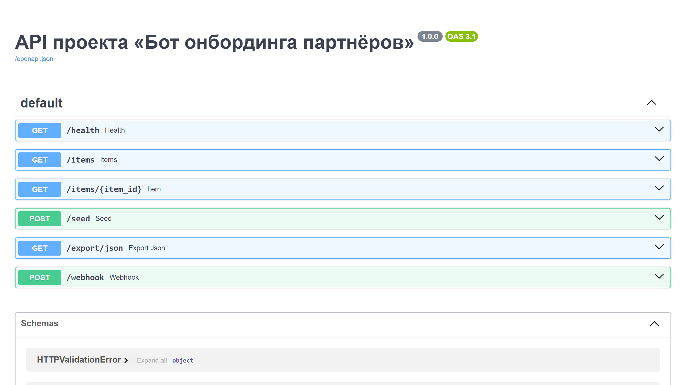

# Бот онбординга партнёров

## Витрина

Скриншоты и GIF складываются в `assets/`.

- shot-list: `SHOTLIST.md`
- assets: `assets/README.md`



`Бот онбординга партнёров` показывает, как Telegram превращается в рабочий контур для B2B-запуска: собирает документы, отслеживает блокеры, ведёт партнёра по этапам и синхронизирует менеджера, legal и операционный блок.

## Что показывает проект

- зрелый сценарий партнёрского онбординга, а не просто анкету в чате;
- контроль документов, комплаенса и статусов готовности к запуску;
- координацию между партнёром, партнёрским менеджером и внутренними командами;
- архитектуру, пригодную для реселлеров, интеграторов, дилерских сетей и marketplace-onboarding.

## Для каких задач подходит

- запуск партнёрской программы с прозрачными этапами;
- онбординг реселлеров и интеграторов;
- сбор документов и контроль юридических блокеров;
- запуск корпоративных партнёров с чеклистом готовности;
- сокращение ручной переписки между менеджером и партнёром.

## Ключевые сценарии

- старт нового партнёра;
- неполный пакет документов;
- блокировка интеграции или комплаенса;
- контроль чеклиста перед запуском;
- корпоративный запуск с несколькими ответственными.

## Роли

- партнёр;
- партнёрский менеджер;
- юридический блок;
- владелец программы.

## Категории

- marketplace;
- реселлерская программа;
- партнёрская сеть;
- интеграционный запуск;
- корпоративный onboarding.

## Состав пакета

- `bot/domain.py`
- `bot/storage.py`
- `bot/workflow.py`
- `bot/analytics.py`
- `bot/reporting.py`
- `bot/policies.py`
- `bot/contracts.py`
- `bot/exports.py`
- `bot/simulation.py`
- `bot/admin.py`
- `bot/messages.py`
- `bot/seeds.py`
- `bot/service.py`
- `bot/repository_sqlite.py`
- `bot/webhooks.py`
- `bot/api.py`
- `bot/cli.py`
- `bot/dashboard_schema.py`
- `bot/fixtures.py`
- `bot/audits.py`
- `bot/benchmarks.py`
- `bot/main.py`
- `tests/test_logic.py`

## Быстрый старт

```bash
pip install -r requirements.txt
python -m bot.main
uvicorn bot.api:create_app --factory --reload
```

## Почему это сильный кейс

- хорошо раскрывает B2B-направление через живой, прикладной процесс;
- показывает, что профиль умеет не только в интерфейсы, но и в координацию сложного запуска;
- помогает заходить в заказы про партнёров, документы, комплаенс, личные кабинеты и интеграционные блокеры.

<!-- COMMERCIAL_CONTEXT:START -->
## Живой коммерческий контекст

- Типовой заказчик: компания с партнёрской программой, дилерской сетью или экосистемой интеграторов.
- Кто принимает решение: partner manager, head of partnerships, руководитель onboarding-направления.
- Типовой запрос: нужен Telegram-контур для онбординга партнёра с документами, комплаенсом, статусами запуска и чеклистом блокеров.
- Формат подачи: это публичный showcase на основе реального рыночного сценария, а не выдуманная история про клиента.
- [Полный коммерческий разбор](./COMMERCIAL_CONTEXT.md)
<!-- COMMERCIAL_CONTEXT:END -->
