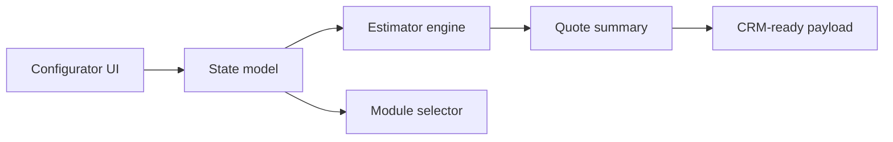

# Архитектура: Quote Configurator Studio

```mermaid
flowchart LR
    A["Configurator UI"] --> B["State model"]
    B --> C["Estimator engine"]
    B --> D["Module selector"]
    C --> E["Quote summary"]
    E --> F["CRM-ready payload"]
```

