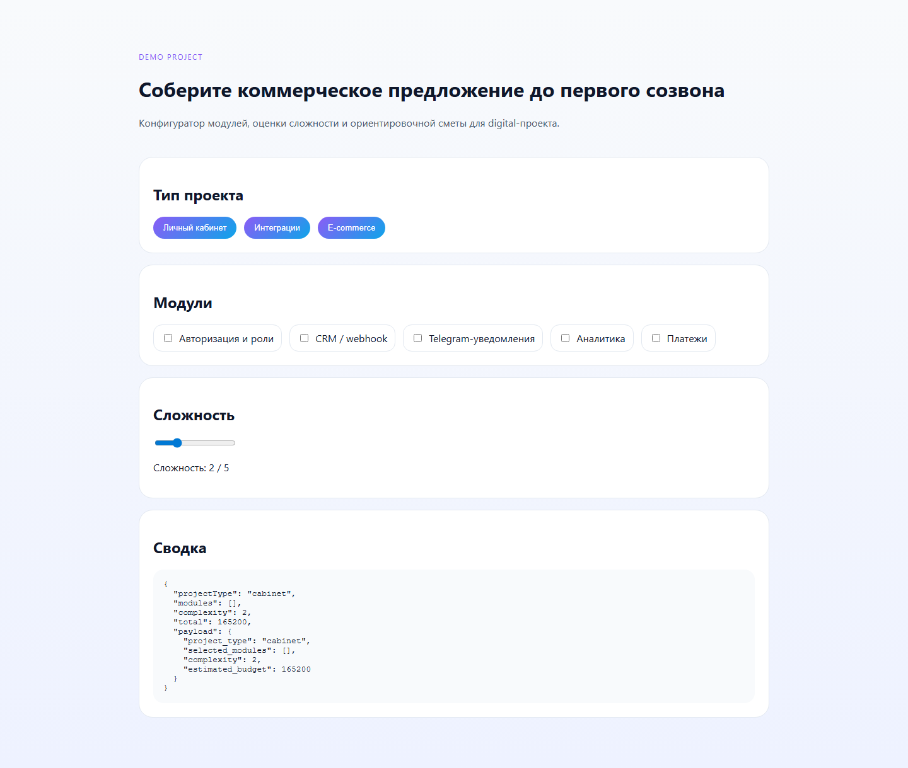
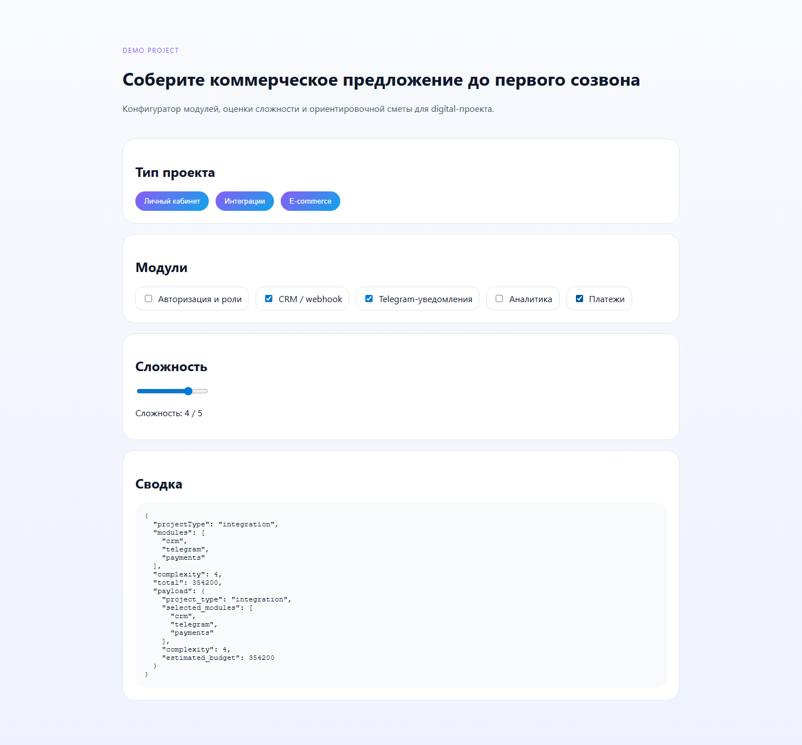

# Студия конфигурации коммерческих предложений

Демонстрационный frontend-инструмент для сборки коммерческого предложения, конфигурации пакета и оценки бюджета.

## Скриншоты

## Что показывает проект

- бизнес-ориентированный frontend;
- configurator вместо обычного лендинга;
- выбор модулей и пакетов;
- расчёт сметы и complexity factor;
- payload для CRM/менеджера.

## Состав пакета

- [CASE.md](C:/Users/KIFER/Desktop/ТГ%20фриланс%20бот/portfolio_lab/projects/quote-configurator-studio/CASE.md)
- [ARCHITECTURE.md](C:/Users/KIFER/Desktop/ТГ%20фриланс%20бот/portfolio_lab/projects/quote-configurator-studio/ARCHITECTURE.md)
- `site/index.html`
- `site/styles.css`
- `site/app.js`
- `seed/content.json`
- `tests/test_content_contract.py`

<!-- COMMERCIAL_CONTEXT:START -->
## Живой коммерческий контекст

- Типовой заказчик: агентство или сервисная компания с ручной сборкой коммерческих предложений
- Кто принимает решение: sales lead, аккаунт-менеджер или владелец агентства
- Типовой запрос: Нужен конфигуратор, который помогает быстро собирать пакет услуг и считать ориентировочную стоимость.
- Формат подачи: это публичный showcase на основе реального рыночного сценария, а не выдуманная история про клиента.
- [Полный коммерческий разбор](./COMMERCIAL_CONTEXT.md)
<!-- COMMERCIAL_CONTEXT:END -->
