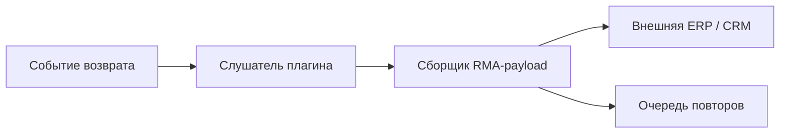

# Архитектура: Returns Sync for WooCommerce

```mermaid
flowchart LR
    A["Событие возврата"] --> B["Слушатель плагина"]
    B --> C["Сборщик RMA-payload"]
    C --> D["Внешняя ERP / CRM"]
    C --> E["Очередь повторов"]
```

