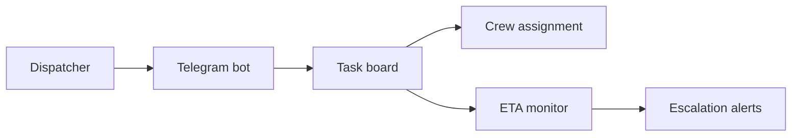

# Архитектура: Telegram Dispatch Desk

```mermaid
flowchart LR
    A["Dispatcher"] --> B["Telegram bot"]
    B --> C["Task board"]
    C --> D["Crew assignment"]
    C --> E["ETA monitor"]
    E --> F["Escalation alerts"]
```

