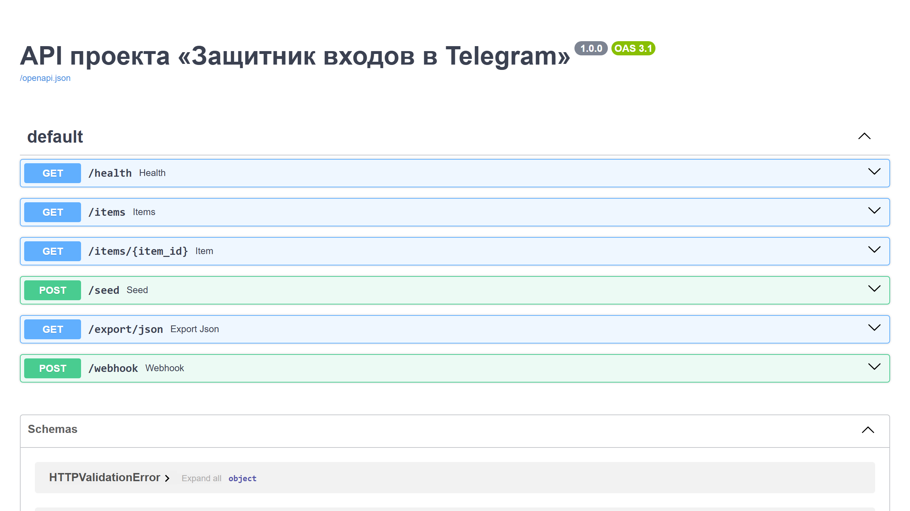

# Защитник входов в Telegram

## Витрина

Скриншоты и GIF складываются в `assets/`.

- shot-list: `SHOTLIST.md`
- assets: `assets/README.md`



`Защитник входов в Telegram` показывает, как Telegram можно встроить в безопасный маршрут подтверждения входа: с оценкой риска, доверенными устройствами, дополнительной проверкой и управлением активными сессиями.

## Что показывает проект

- сценарий подтверждения входа через Telegram как часть security workflow;
- риск-ориентированную логику вместо примитивного “отправили код и забыли”;
- работу с доверенными устройствами, подозрительными событиями и отзывом сессий;
- пригодную архитектуру для личных кабинетов, админок, корпоративных порталов и внутренних сервисов.

## Для каких задач подходит

- подтверждение входа в кабинет или B2B-портал через Telegram;
- дополнительная защита админ-панелей и чувствительных разделов;
- реакция на подозрительные IP, устройства и аномальные входы;
- журнал активных сессий и управление безопасностью без отдельного мобильного приложения;
- прикладные anti-fraud и MFA-сценарии.

## Ключевые сценарии

- вход с нового устройства;
- вход с повышенным риском;
- усиленная проверка для важного действия;
- отзыв подозрительной сессии;
- ревизия активных сессий пользователем.

## Роли

- пользователь;
- специалист по безопасности;
- администратор;
- владелец продукта.

## Категории

- админ-панель;
- партнёрский кабинет;
- VPN и внутренние сервисы;
- CRM;
- финтех и финансовые кабинеты.

## Состав пакета

- `bot/domain.py`
- `bot/storage.py`
- `bot/workflow.py`
- `bot/analytics.py`
- `bot/reporting.py`
- `bot/policies.py`
- `bot/contracts.py`
- `bot/exports.py`
- `bot/simulation.py`
- `bot/admin.py`
- `bot/messages.py`
- `bot/seeds.py`
- `bot/service.py`
- `bot/repository_sqlite.py`
- `bot/webhooks.py`
- `bot/api.py`
- `bot/cli.py`
- `bot/dashboard_schema.py`
- `bot/fixtures.py`
- `bot/audits.py`
- `bot/benchmarks.py`
- `bot/main.py`
- `tests/test_logic.py`

## Быстрый старт

```bash
pip install -r requirements.txt
python -m bot.main
uvicorn bot.api:create_app --factory --reload
```

## Почему это сильный кейс

- хорошо продаёт редкий и дорогой сценарий: `Telegram + security + access control`;
- показывает зрелое мышление вокруг риска, а не только интерфейсов;
- полезен для заказчиков, которым нужен безопасный вход без разработки отдельного mobile security-приложения.

<!-- COMMERCIAL_CONTEXT:START -->
## Живой коммерческий контекст

- Типовой заказчик: онлайн-сервис, B2B-кабинет или внутренняя система с повышенными требованиями к безопасности.
- Кто принимает решение: CTO, tech lead, product owner или специалист по безопасности.
- Типовой запрос: нужен Telegram-контур подтверждения входа с оценкой риска, доверенными устройствами и возможностью отзывать сессии.
- Формат подачи: это публичный showcase на основе реального рыночного сценария, а не выдуманная история про клиента.
- [Полный коммерческий разбор](./COMMERCIAL_CONTEXT.md)
<!-- COMMERCIAL_CONTEXT:END -->
