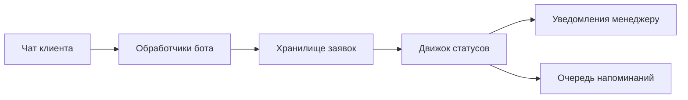

# Архитектура: Telegram Service Bot

```mermaid
flowchart LR
    A["Чат клиента"] --> B["Обработчики бота"]
    B --> C["Хранилище заявок"]
    C --> D["Движок статусов"]
    D --> E["Уведомления менеджеру"]
    D --> F["Очередь напоминаний"]
```

## Ключевой принцип

Telegram используется как интерфейс процесса, а не только как канал входящего сообщения.

