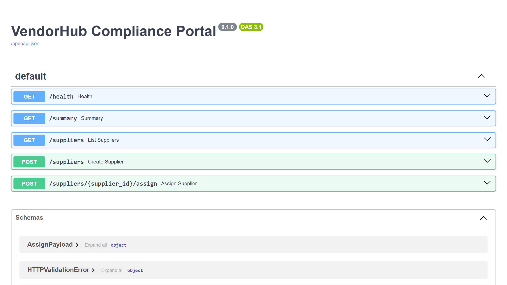

# Портал комплаенса поставщиков VendorHub

## Витрина

Скриншоты и GIF складываются в `assets/`.

- shot-list: `SHOTLIST.md`
- assets: `assets/README.md`

Демонстрационный B2B-портал для онбординга поставщиков, проверки документов и маршрутов согласования.

## Что показывает проект

- онбординг поставщиков;
- комплаенс-скоринг;
- матрицу согласования;
- эскалацию по зависшим карточкам;
- международные и рискованные сценарии.

## Для каких задач подходит

- управление поставщиками;
- B2B кабинеты;
- комплаенс и документооборот;
- порталы онбординга и внутренние админки.

## Состав пакета

- [CASE.md](C:/Users/KIFER/Desktop/ТГ%20фриланс%20бот/portfolio_lab/projects/vendorhub-compliance-portal/CASE.md)
- [ARCHITECTURE.md](C:/Users/KIFER/Desktop/ТГ%20фриланс%20бот/portfolio_lab/projects/vendorhub-compliance-portal/ARCHITECTURE.md)
- `app/domain.py` — домен поставщика и логика согласования;
- `app/main.py` — API-слой;
- `seed/demo_seed.json` — демо-поставщики;
- `tests/test_domain.py` — минимальные тесты.

<!-- COMMERCIAL_CONTEXT:START -->
## Живой коммерческий контекст

- Типовой заказчик: B2B-компания с поставщиками или подрядчиками на этапе проверки
- Кто принимает решение: procurement lead, operations manager или руководитель комплаенса
- Типовой запрос: Нужен портал онбординга поставщиков с документами, оценкой риска и маршрутами согласования.
- Формат подачи: это публичный showcase на основе реального рыночного сценария, а не выдуманная история про клиента.
- [Полный коммерческий разбор](./COMMERCIAL_CONTEXT.md)
<!-- COMMERCIAL_CONTEXT:END -->
